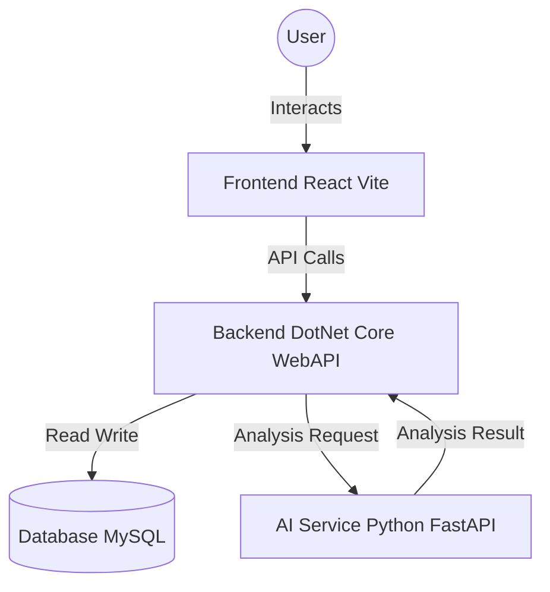

# HireLens AI - The Intelligent Recruitment Ecosystem

**HireLens AI** is a comprehensive, full-stack recruitment platform driven by advanced machine learning. It bridges the gap between talent and opportunity by automating resume screening, role validation, and skill-gap analysis. 

This document serves as the **complete manual** for the project, covering its architecture, installation, technical implementation, and a detailed guide to every functionality.

---

## 📑 Table of Contents
1. [Project Overview](#-project-overview)
2. [System Architecture](#-system-architecture)
3. [User Functionalities (The Product)](#-user-functionalities-the-product)
    - [Authentication & Roles](#1-authentication--roles)
    - [Applicant Portal Features](#2-applicant-portal)
    - [Recruiter Portal Features](#3-recruiter-portal)
4. [Machine Learning Pipeline](#-machine-learning-pipeline)
5. [Data Strategy & Datasets](#-data-strategy--datasets)
6. [Technical Stack](#-technical-stack)
7. [Installation & Setup](#-installation--setup)
8. [Project Structure](#-project-directory-structure)
9. [Project Progress](#-project-progress)
10. [Troubleshooting](#-troubleshooting)

---

## 📈 Project Progress

Stay up to date with our current development status and timeline:
- [Project Status Report](file:///d:/HireLens/PROJECT_STATUS.md)
- [Project Roadmap & Timeline](file:///d:/HireLens/PROJECT_TIMELINE.md)
- [Architecture & Workflow Flow](file:///d:/HireLens/project_flow.md)

---

## 🚀 Project Overview

**The Hiring "Black Box" Problem**: Traditional hiring processes are opaque and inefficient. 
- **For Candidates**: It involves submitting resumes into a void with no feedback. Rejection often comes without improved understanding of *why* or *how* to improve.
- **For Recruiters**: Keyword-based screening misses qualified candidates who use different terminology. High volumes of applications lead to fatigue and oversight.

**The HireLens Solution**: An intelligent recruitment ecosystem that bridges this gap.
- **Transparency**: Provides candidates with "Gap Analysis" — knowing exactly why they were not a 100% match and what skills they are missing.
- **Intelligence**: Uses NLP (Named Entity Recognition and BERT) to understand the *meaning* of resumes, not just keyword matching.
- **Efficiency**: Automates initial screening and scoring, allowing recruiters to focus on the best candidates.

---

## 🏗️ System Architecture

The application operates as a cohesive trio of services:

1.  **Frontend (React)**: The user interface layer.
2.  **Backend (.NET API)**: The business logic and data management layer.
3.  **AI Service (Python)**: The intelligence layer for NLP and analysis.



### Key Controllers
| Controller | Responsibility |
| :--- | :--- |
| `AuthController` | Login, Signup, Token Generation. |
| `ProfilesController` | Management of Applicant & Recruiter profiles. |
| `JobsController` | Creating, editing, and listing job postings. |
| `ApplicationsController` | Handling the act of applying and tracking status. |
| `ResumesController` | Uploading and parsing resume files. |
| `AnalysisController` | Bridge between .NET and Python AI Service. |
## 🌟 User Functionalities (The Product)

This section details every feature available in the application.

### 1. Authentication & Roles
*   **Unified Login**: A robust login system that supports two distinct personas.
*   **Role Selection**: Users can toggle between **Applicant** and **Recruiter** modes.
    *   *Note: Currently simulates authentication via LocalStorage for rapid prototyping.*

### 2. Applicant Portal
Designed to empower job seekers with data-driven insights.

*   **🏠 Applicant Home & Dashboard**
    *   **Welcome Center**: Personalised greeting and "At a Glance" stats.
    *   **Action Hub**: Quick links to Gap Analysis, Job Search, and Interview Prep.
    *   **News Feed**: A real-time news ticker showing hiring trends and industry updates (Powered by NewsAPI).

*   **📊 Gap Analysis Engine (The Core Feature)**
    *   **Input**: Takes the user's resume and a target job description.
    *   **Processing**: Uses the Python NER model to extract skill sets from both documents.
    *   **Output**: 
        *   **Fit Score**: A percentage (0-100%) indicating match quality.
        *   **Matched Skills**: Green-highlighted skills that overlap.
        *   **Missing Skills**: Red-highlighted skills that the job requires but the user lacks.
        *   **Skill Clouds**: Visual representation of the skill gap.

*   **📝 ATS Score Checker**
    *   Analyzes the resume structure and keywords to predict "passability" through standard Applicant Tracking Systems.
    *   Provides actionable tips (e.g., "Add more strong action verbs").

*   **🤖 Interview Copilot**
    *   A mock interview tool that uses the job description to generate relevant technical and behavioral questions.
    *   **Session Management**: Create, Load, and Delete past interview sessions.
    *   **Privacy**: Deletion is confirmed via a custom modal and permanently removes chat history.
    *   Helps candidates practice before the real interview.

*   **💼 Job Search**
    *   A curated list of jobs that match the user's analyzed profile.

### 3. Recruiter Portal
Designed to streamline the hiring workflow.

*   **📈 Recruiter Dashboard**
    *   **Analytics**: Visual charts showing "Total Applications", "Time to Hire", and "Active Jobs".
    *   **Pipeline View**: A funnel view of candidates in different stages (Applied, Interviewing, Hired).

*   **✍️ Smart Job Creation**
    *   **Dynamic Form**: A rich interface to input Job Title, Department, Salary Range, and Description.
    *   **Requirement Builder**: Interactive list builder to add specific technical requirements (e.g., "React", "5+ Years Experience").
    *   **AI Enhancement**: The system (future) suggests requirements based on the Job Title entered.

*   **👥 Talent Pool**
    *   **Candidate Search**: Searchable database of applicants.
    *   **Smart Ranking**: Candidates are automatically sorted by their AI fit score, not just alphabetical order.
    *   **Profile Preview**: Click to expand a candidate card and see their "Gap Analysis" from the recruiter's perspective.

*   **📊 Analytics Suite**
    *   Deep dive metrics into which jobs are attracting the most attention and where candidates are dropping off.

*   **📅 Interview & Hiring Workflow**
    *   **Interactive Scheduling**: Schedule interviews directly from the platform.
    *   **Status Tracking**: Real-time updates for "Interview Scheduled", "Interview Accepted", and "Hired".
    *   **Hire Button**: One-click hiring action that automatically closes the loop.

*   **🔄 Advanced Re-application Logic**
    *   Rejected candidates can re-apply, updating their status to "Reapplied" with a fresh timestamp and score.
    *   **Auto-Close**: Jobs automatically close when the number of desired openings is filled.

---

## 🧠 Machine Learning Pipeline

The "Brain" of HireLens AI is a custom-built Python service.

### 1. Named Entity Recognition (NER) model
*   **Purpose**: To read a resume like a human recruiter would.
*   **Technology**: Spacy (Transformer-based).
*   **Entities Extracted**:
    1.  `SKILLS`: Programming languages, tools, frameworks.
    2.  `EXPERIENCE`: Duration labels (e.g., "5 years", "2019-2023").
    3.  `DESIGNATION`: Job titles (e.g., "Senior Developer").
*   **Training Data**: `datasets/Entity Recognition in Resumes.json`.

### 2. Role Classification Model
*   **Purpose**: To tag a resume with a specific domain.
*   **Technology**: BERT (Bidirectional Encoder Representations from Transformers) - `bert-base-uncased`.
*   **Capabilities**: Classifies text into 20+ roles (Data Science, HR, Engineering, Sales, etc.).
*   **Training Data**: `datasets/Resume/Resume.csv`.

---

## 🗄️ Data Strategy & Datasets

### A. Datasets (`/datasets`)
1.  **Resume Entities (`Entity Recognition in Resumes.json`)**:
    -   **Source**: Kaggle / Open Source.
    -   **Size**: ~220 labelled resumes.
    -   **Labels**: `Skills`, `Designation`, `BoE`, `Experience`, `Location`, `Companies worked at`.
    -   **Usage**: Training the custom Spacy NER model.

2.  **Job Market Data (`jobs_main.csv`)**:
    -   **Source**: Scraped from LinkedIn / Indeed.
    -   **Size**: 680+ records.
    -   **Experience**: Populates the "Jobs" feed.

### B. Database Schema (MySQL)
-   **Users**: `Id`, `Email`, `PasswordHash`, `Role`, `ProfileParams`
-   **Resumes**: `Id`, `UserId`, `FilePath`, `ParsedText`, `UploadedAt`
-   **Jobs**: `Id`, `RecruiterId`, `Title`, `Description`, `RequiredSkills`, `Status`
-   **Applications**: `Id`, `JobId`, `candidateId`, `Status`, `RankingScore`
-   **CandidateRankings**: `Id`, `JobId`, `CandidateId`, `TotalScore`, `SkillScore`, `RoleConfidence`, `MissingSkills`

---

## 💻 Technical Stack

### Frontend (User Interface)
| Technology | Description |
|------------|-------------|
| **React 18** | Component-based UI library. |
| **Vite** | Next-generation build tool (Super fast). |
| **Framer Motion** | Physics-based animation library (Page transitions). |
| **Glassmorphism** | Custom CSS design system using backdrops and blurs. |
| **Lucide React** | Consistent, clean icon set. |

### Backend (API Gateway)
| Technology | Description |
|------------|-------------|
| **.NET 10** | Cutting-edge high-performance web framework. |
| **C#** | Strongly typed language for business logic. |
| **ASP.NET Core WebAPI** | RESTful endpoint architecture. |
| **HttpClientFactory** | efficient HTTP communication with the Python service. |

### AI Microservice (Intelligence)
| Technology | Description |
|------------|-------------|
| **Python 3.12** | The standard for Machine Learning. |
| **FastAPI** | High-performance async web framework. |
| **PyTorch** | Deep learning framework for BERT. |
| **Spacy** | Industrial-strength NLP. |

---

## 🛠️ Installation & Setup

Follow these distinct steps to launch the entire ecosystem.

### Prerequisites (Check these first!)
*   [ ] Node.js (v18 or higher)
*   [ ] .NET 10 SDK
*   [ ] Python 3.10+

### Step 1: Ignite the AI Engine 🧠
The brain must come alive first.

```bash
cd D:/HireLens
# Create virtual environment (if not exists)
python -m venv venv
# Activate it (Windows)
.\venv\Scripts\activate
# Install deps
pip install -r requirements.txt
# Download language model
python -m spacy download en_core_web_sm
# Start the API
cd api
uvicorn main:app --reload --host 0.0.0.0 --port 8000
```
*Verify at: http://localhost:8000/docs*

### Step 2: Launch the Backend 🛡️
The gateway needs to be ready.

```bash
# New Terminal
cd D:/HireLens/backend/SmartHireAI.Backend
dotnet restore
dotnet ef database update
dotnet run
```
*Verify at: http://localhost:5033/swagger*

### Step 3: Start the Frontend 🎨
The interface for the user.

```bash
# New Terminal
cd D:/HireLens/frontend
npm install
npm run dev
```
*Verify at: http://localhost:5173*

### Step 4: Enable Email Verification on External Devices (Optional) 📧

To test email verification from mobile devices or other computers during development:

```bash
# Install ngrok
choco install ngrok

# Start ngrok tunnel (in a new terminal)
ngrok http 5000 --host-header="localhost:5000"

# Set environment variable with your ngrok URL
$env:AppSettings__BaseUrl="https://your-ngrok-url.ngrok-free.app"

# Restart backend server
cd D:/HireLens/backend/SmartHireAI.Backend
dotnet run
```

**📖 Detailed Guide:** See [TUNNELING_SETUP.md](TUNNELING_SETUP.md) for complete instructions.

**Why?** Email verification links default to `localhost:5173`, which only works on your development machine. Using ngrok creates a secure HTTPS tunnel, allowing verification links to work from any device.

**Production:** Simply update `AppSettings:BaseUrl` to your production domain - no code changes needed!

---

## 📂 Project Directory Structure

```plaintext
D:/HireLens/
├── api/                        # [Python] The AI Brain
│   ├── main.py                 # API Endpoints
│   ├── models.py               # Data definitions
│   └── ...
├── backend/                    # [.NET] The Gateway
│   └── SmartHireAI.Backend/    # C# Solution
├── frontend/                   # [React] The Face
│   ├── src/
│   │   ├── pages/              # (Login, Dashboard, Analysis, etc.)
│   │   ├── components/         # (Navbar, JobCard, Charts)
│   │   └── context/            # (Auth, Toast)
├── data/                       # Pre-processed binaries
├── datasets/                   # Raw CSVs and JSONs
├── models/                     # Saved .pkl and .spacy models
└── scripts/                    # ML Training logic (train_ner.py)
```

---

## 🔧 Troubleshooting

*   **Error: "Fetch failed" in Frontend**
    *   Is the .NET Backend running? The frontend tries to talk to the backend, not the python service directly.
*   **Error: "503 AI Service Unavailable"**
    *   Is the Python `uvicorn` server running on port 8000? The .NET backend needs this to function.
*   **Error: "Module not found: transformers"**
    *   Did you activate the python virtual environment (`.\venv\Scripts\activate`) before running the server?

---

**HireLens AI** - bridging the gap between talent and opportunity.
