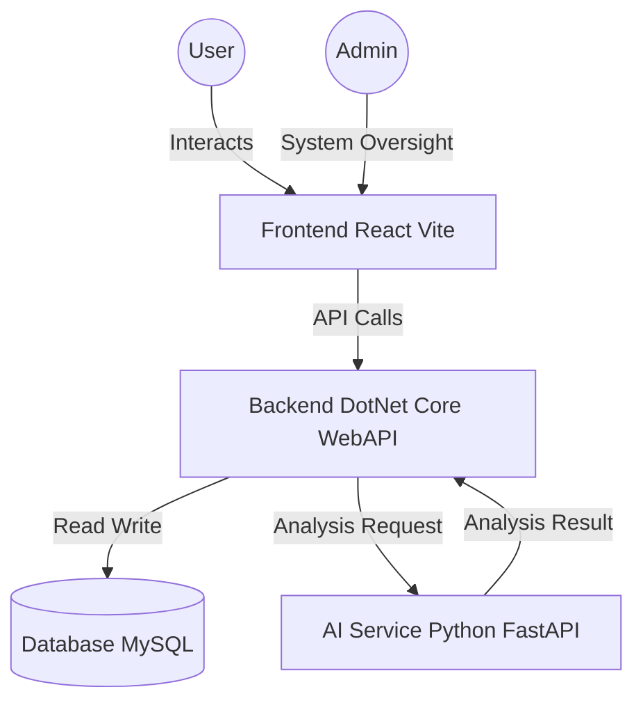

# HireLens AI - The Intelligent Recruitment Ecosystem

**HireLens AI** is a comprehensive, full-stack recruitment platform driven by advanced machine learning. It bridges the gap between talent and opportunity by automating resume screening, role validation, and skill-gap analysis. 

This document serves as the **complete manual** for the project, covering its architecture, installation, technical implementation, and a detailed guide to every functionality.

---

## 📑 Table of Contents
1. [Project Overview](#-project-overview)
2. [System Architecture](#-system-architecture)
3. [User Functionalities (The Product)](#-user-functionalities-the-product)
    - [Authentication & Roles](#1-authentication--roles)
    - [Applicant Portal Features](#2-applicant-portal)
    - [Recruiter Portal Features](#3-recruiter-portal)
    - [Admin Suite Features](#4-admin-suite)
    - [Monetization & Subscriptions](#5-monetization--subscriptions)
4. [Machine Learning Pipeline](#-machine-learning-pipeline)
5. [Data Strategy & Datasets](#-data-strategy--datasets)
6. [Technical Stack](#-technical-stack)
7. [Installation & Setup](#-installation--setup)
8. [Project Structure](#-project-directory-structure)
9. [Project Progress](#-project-progress)
10. [Troubleshooting](#-troubleshooting)

---

## 📈 Project Progress

Stay up to date with our current development status and timeline:
- [Project Status Report](file:///d:/EDU/INTERNSHIP/HireLens/PROJECT_STATUS.md)
- [Project Roadmap & Timeline](file:///d:/EDU/INTERNSHIP/HireLens/PROJECT_TIMELINE.md)
- [Architecture & Workflow Flow](file:///d:/EDU/INTERNSHIP/HireLens/project_flow.md)
- [Technical Details](file:///d:/EDU/INTERNSHIP/HireLens/project_details.md)

---

## 🚀 Project Overview

**The Hiring "Black Box" Problem**: Traditional hiring processes are opaque and inefficient. 
- **For Candidates**: It involves submitting resumes into a void with no feedback. Rejection often comes without improved understanding of *why* or *how* to improve.
- **For Recruiters**: Keyword-based screening misses qualified candidates who use different terminology. High volumes of applications lead to fatigue and oversight.
- **For Executives**: Managing thousands of users and jobs without aggregated analytics leads to strategic blindness.

**The HireLens Solution**: An intelligent recruitment ecosystem that bridges this gap.
- **Transparency**: Provides candidates with "Gap Analysis" — knowing exactly why they were not a 100% match and what skills they are missing.
- **Intelligence**: Uses NLP (Named Entity Recognition and BERT) to understand the *meaning* of resumes, not just keyword matching.
- **Efficiency**: Automates initial screening and scoring, allowing recruiters to focus on the best candidates.
- **Oversight**: A dedicated Admin layer provides system-wide moderation and deep-dive analytics.

---

## 🏗️ System Architecture

The application operates as a cohesive trio of services:

1.  **Frontend (React)**: The user interface layer (Applicant, Recruiter, and Admin portals).
2.  **Backend (.NET API)**: The business logic, data management, and security layer.
3.  **AI Service (Python)**: The intelligence layer for NLP and analysis.


```mermaid
graph TD
    User((User))
    Admin((Admin))
    Frontend[Frontend React Vite]
    Backend[Backend DotNet Core WebAPI]
    DB[(Database MySQL)]
    AI[AI Service Python FastAPI]

    User -->|Interacts| Frontend
    Admin -->|System Oversight| Frontend
    Frontend -->|API Calls| Backend
    Backend -->|Read Write| DB
    Backend -->|Analysis Request| AI
    AI -->|Analysis Result| Backend

```

### Key Controllers
| Controller | Responsibility |
| :--- | :--- |
| `AuthController` | Login, Signup, Token Generation for all roles. |
| `ProfilesController` | Management of Applicant & Recruiter profiles. |
| `JobsController` | Creating, editing, and listing job postings. |
| `ApplicationsController` | Handling the act of applying and tracking status. |
| `ResumesController` | Uploading and parsing resume files. |
| `AnalysisController` | Bridge between .NET and Python AI Service. |
| `InboxController` | Management of notifications and messages. |
| `AdminController` | System moderation, User/Job overrides. |
| `AdminAnalyticsController` | High-level data aggregation for executive dashboards. |

## 🌟 User Functionalities (The Product)

This section details every feature available in the application.

### 1. Authentication & Roles
*   **Unified Login**: A robust login system supporting three distinct personas.
*   **Role Selection**: Users can toggle between **Applicant**, **Recruiter**, and **Admin** modes.
*   **Secure Access**: Role-Based Access Control (RBAC) ensures users only see relevant dashboards.
*   **Account Recovery**: Secure 3-step "Forgot Password" flow using OTP verification and short-lived reset tokens.

### 2. Applicant Portal
*   **🏠 Applicant Home & Dashboard**: Personalised greeting and "At a Glance" stats.
*   **📊 Gap Analysis Engine**: Real-time Fit Score, Matched vs. Missing skills, and Skill Clouds.
*   **📝 ATS Score Checker**: Predicts "passability" through standard ATS systems.
*   **🤖 Interview Copilot**: Mock interview tool generating relevant questions based on JDs.
*   **🔔 Notification Center**: Real-time alerts for Interview Schedules and Messages.
*   **💼 Job Search**: Curated list of jobs matching the user's analyzed profile.

### 3. Recruiter Portal
*   **📈 Recruiter Dashboard**: Analytics for "Total Applications", "Time to Hire", and "Active Jobs".
*   **✍️ Smart Job Creation**: Dynamic form for job requirements with AI-driven suggestions.
*   **👥 Talent Pool**: Searchable database of applicants with **Smart Ranking** (AI fit score).
*   **📅 Interview & Hiring Workflow**: Interactive scheduling, unified contact interface, and one-click hiring.
*   **🔄 Advanced Re-application Logic**: Handles re-applicants with fresh scoring.

### 4. Admin Suite (New)
*   **🏛️ Admin Dashboard**: Central control hub for system health (Backend, DB, AI Service).
*   **📊 Executive Analytics**: Deep-dive charts for User Growth, Hiring Funnels, and Skill Trends.
*   **🛡️ User Management**: Full pagination, role-based filtering, and inline role modulation.
*   **📋 Job Moderation**: Global oversight of job postings with recruiter tracking and status toggles.
*   **📜 Audit Stream (System Logs)**: Searchable "Terminal-style" audit trail of all platform events.

### 5. Monetization & Subscriptions (New)
*   **💳 Tiered Pricing Plans**: Implementation of "FREE", "PRO", and "ENTERPRISE" models.
*   **📊 Usage Tracking**: Real-time monitoring of job postings and resume analysis based on plan limits.
*   **📈 Subscription Dashboard**: Dedicated billing view for managing plans and viewing usage stats.
*   **🛡️ Plan Enforcement**: Automatic restrictions on features based on the user's active subscription tier.

---

## 🧠 Machine Learning Pipeline

The "Brain" of HireLens AI is a custom-built Python service.

### 1. Named Entity Recognition (NER) model
*   **Purpose**: To read a resume like a human recruiter would.
*   **Technology**: Spacy (Transformer-based).
*   **Entities Extracted**: `SKILLS`, `EXPERIENCE`, `DESIGNATION`, `DEGREE`, `LOCATION`.

### 2. Role Classification Model
*   **Purpose**: To tag a resume with a specific domain (e.g., Data Science, Engineering).
*   **Technology**: BERT (`bert-base-uncased`).

---

## 🗄️ Data Strategy & Datasets

### A. Datasets (`/datasets`)
1.  **Resume Entities (`Entity Recognition in Resumes.json`)**: Training the custom Spacy NER model.
2.  **Job Market Data (`jobs_main.csv`)**: Populates the "Jobs" feed.

### B. Database Schema (MySQL)
-   **Users**: Detailed profiling with state management (Active/Inactive) and Roles.
-   **Resumes**: Parsed text storage and binary file tracking.
-   **Jobs / Applications**: Complete lifecycle tracking from "Open" to "Hired".
-   **SystemLogs**: Specialized table for administrative transparency.

---

## 💻 Technical Stack

### Frontend (User Interface)
| Technology | Description |
|------------|-------------|
| **React 18** | Component-based UI library. |
| **Vite** | Next-generation build tool. |
| **SignalR Client** | **Real-time socket communication for analytics.** |
| **Recharts** | Interactive data visualizations. |
| **Framer Motion** | Physics-based animation library. |
| **Glassmorphism** | Custom CSS design system using backdrops and blurs. |

### Backend (API Gateway)
| Technology | Description |
|------------|-------------|
| **.NET 10** | Cutting-edge high-performance web framework. |
| **C# 12** | Strongly typed language for business logic. |
| **SignalR Hub** | **Real-time broadcast of system events.** |
| **Entity Framework 10** | Advanced ORM for MySQL management. |
| **JWT** | Secure, stateless authentication. |
| **PlanRequirement** | Custom attribute layer for feature-access enforcement. |
| **IMemoryCache** | Efficiency layer for dashboard analytics. |

### AI Microservice (Intelligence)
| Technology | Description |
|------------|-------------|
| **Python 3.12** | The standard for Machine Learning. |
| **FastAPI** | High-performance async web framework. |
| **PyTorch / Spacy** | Industrial-strength NLP and Deep Learning. |

---

## 🛠️ Installation & Setup

1. **Clone the Repo**: `git clone ...`
2. **Environment**: Configure `.env` and `appsettings.json`.
3. **Database**: Run `dotnet ef database update`.
4. **Services**: Start Backend (`dotnet run`), Frontend (`npm run dev`), and AI Service (`uvicorn main:app`).

---

## 📂 Project Directory Structure

```plaintext
D:/HireLens/
├── api/                        # [Python] The AI Brain
├── backend/                    # [.NET] The Gateway
├── frontend/                   # [React] The Face
│   ├── src/
│   │   ├── pages/admin/        # (Admin Panel)
│   │   ├── components/admin/   # (Admin specific components)
│   │   └── ...
├── data/                       # Pre-processed binaries
├── datasets/                   # Raw CSVs and JSONs
├── models/                     # Saved .pkl and .spacy models
└── scripts/                    # ML Training logic
```

---

## 🔧 Troubleshooting

*   **Error: "Admin view missing"**
    *   Ensure your user account has the `Role: 2` (Admin) in the MySQL database.
*   **Error: "Analytics not loading"**
    *   Check if the `AdminAnalyticsController` endpoints are returning data.

---

**HireLens AI** - bridging the gap between talent and opportunity.
